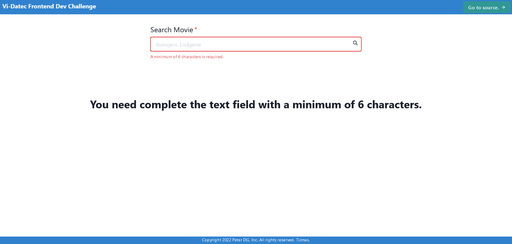
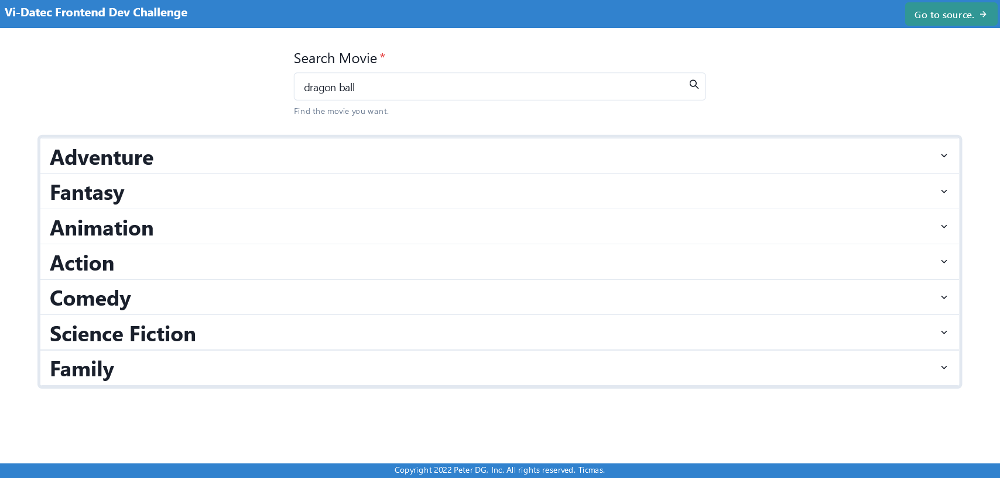
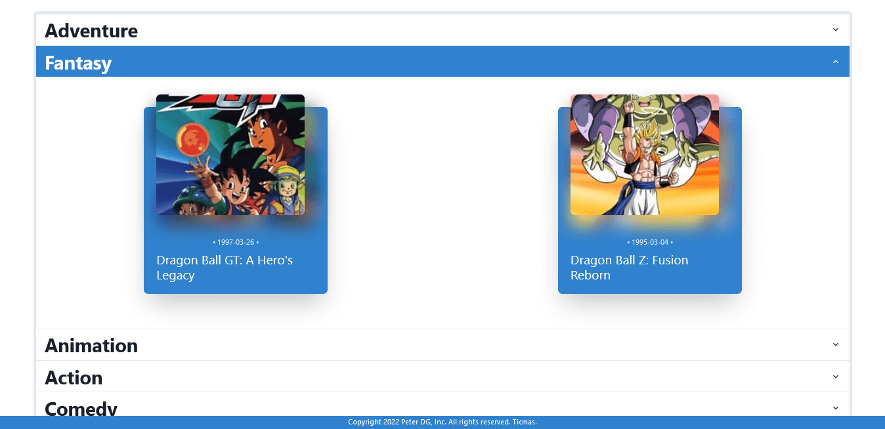
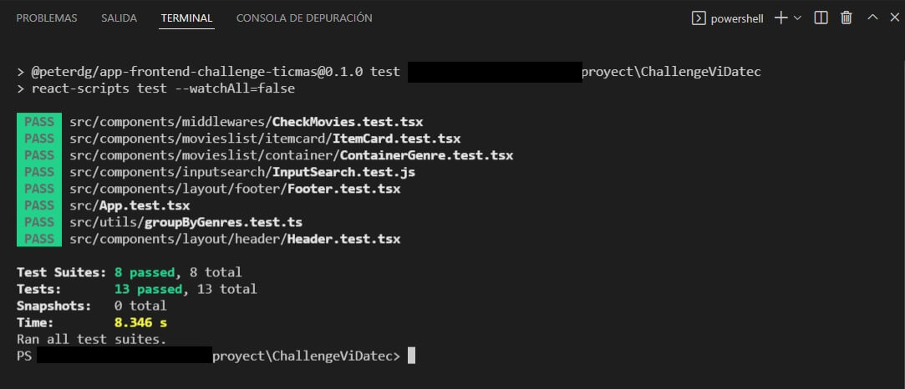
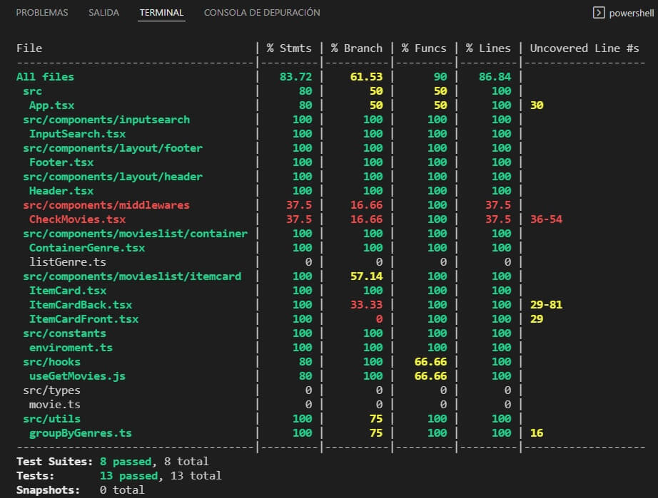
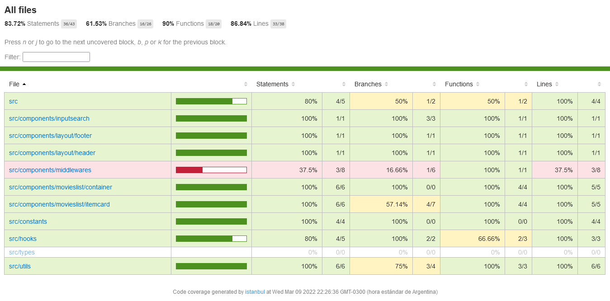
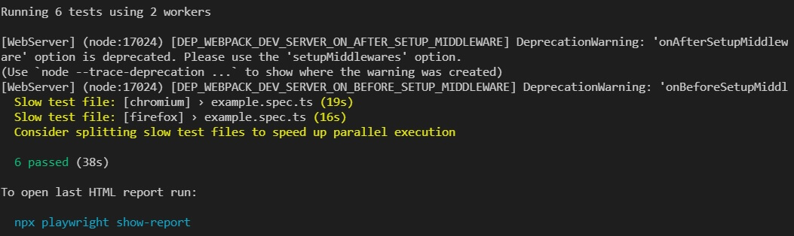
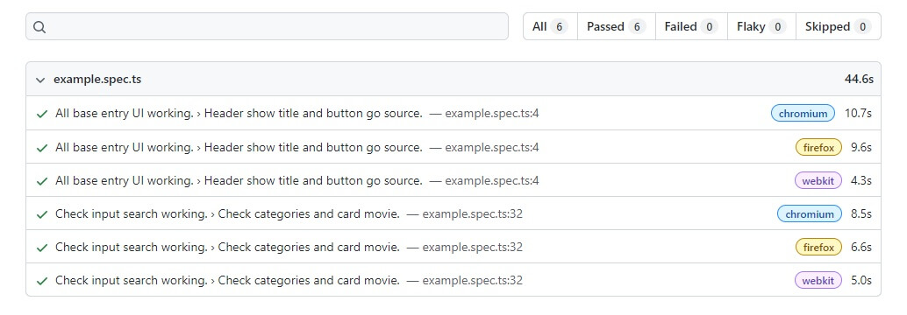

<h2 align="center">
  Desafío Frontend Ticmas
</h2>
<div align="center">
  
</div>

---

## Tabla de Contenido - Index

1. [¿Qué es esto?](#what)
2. [Instalación e inicialización de la aplicación](#install)
3. [Demostración de la aplicación corriendo](#demo)
4. [Pruebas Realizadas](#test)
5. [Tecnologías Utilizadas](#tech)
6. [Licencia](#license)

---

### ¿Qué es esto? <a name="what"></a>

Un desafío para poder comprobar habilidades relacionadas al desarrollo web frontend. Propuesto por [Ticmas](https://www.ticmas.com/)(Vi-Datec).

Las especificaciones y requerimientos se encuentra en el siguiente archivo:

[Challenge - PDF](readme-resources/Vi-DatecFrontendDevChallenge.pdf)

---

### Instalación e inicialización de la aplicación <a name="install"></a>

Los siguientes pasos son para clonarlo y revisar localmente el proyecto:

1. En tu consola favorita coloca (necesitaras tener [Git](https://git-scm.com/downloads) instalado):

`git clone https://github.com/PeterDamianG/ChallengeTicmas.git`

2. En el lugar donde lo hayas descargado, nos movemos al directorio:

`cd ChallengeTicmas`

3. El siguiente paso consiste en instalar todas las dependencias del desarrollo (si no has usado con anterioridad [Playwright](https://playwright.dev/) puede llegar a demorar bastante):

`npm install`

4. Antes de poder levantar el proyecto en modo de desarrollo, debemos configurar obligatoriamente una variable de entorno:

Nos dirigiremos al archivo de configuración de entorno llamado "env.example", eliminamos su extensión, dejándolo como "env" y dentro veremos:

```
REACT_APP_API_URL=https://api.themoviedb.org/3/search/movie?api_key=

REACT_APP_API_IMG=https://image.tmdb.org/t/p/w200/

REACT_APP_API_KEY=

REACT_APP_LIMIT_SEARCH=6
```

En la línea "REACT_APP_API_KEY", debemos escribir nuestra API KEY quedando por ejemplo de la siguiente manera:

`REACT_APP_API_KEY=a131415bc3dafd1f2058dd2568376fd1`

Aclaración: Esa API KEY es inventada, necesitas obtener la tuya propia desde [The-Movie-DB](https://developers.themoviedb.org/3/getting-started/introduction).

5. Después de obtener una KEY valida podremos levantar el app en modo desarrollo para observarla con el siguiente comando:

`npm start`

La aplicación comenzara a funcionar en [LocalHost](http://localhost:3000/).

---

### Demostración de la aplicación corriendo <a name="demo"></a>

Estás son algunas imágenes del proyecto corriendo:

##### Inicio:



##### Categorías/Generos:



##### Desglosando una Categoría/Genero:



##### En movimiento:


---

## Pruebas Realizadas <a name="test"></a>

### Unitarias e Integración:

Para la realización de pruebas unitarias e integración, se utilizo [Jest](https://jestjs.io/) y como complemento [TestingLibrary](https://testing-library.com/). Con los siguientes comandos correremos la batería de pruebas:

#### npm run test

Este comando correrá los archivos con extensión <b>\*.test.{ts,tsx,js,jsx}</b> entre otros, pero esos son los que nos interesan. Ya que son toda la batería de pruebas de nuestro proyecto. La siguiente es una imagen del resultado:



#### npm run test-coverage

Este comando generara una carpeta llamada <b>"coverage"</b> la cual contendrá una visión de la cantidad del proyecto que actualmente se encuentra cubierta por pruebas. Luego de recorrer toda la batería de pruebas, se mostrará el resultado por consola:



#### npm run see-coverage

En caso de ya haber corrido el anterior comando, también tenemos la opción de ver la cobertura de las pruebas de una manera más amigable. Esto abrirá nuestro navegador con lo siguiente:



Aclaración: Solo se busco obtener un porcentaje por encima de 75%, lo cual se considera bueno. No estaba en el objetivo optimizar hasta lo más cercano a 100%.

### End to End (de punta a punta):

Para la realización de pruebas e2e, se utilizo [Playwright](https://playwright.dev/). Con el siguiente comando correremos la batería de pruebas:

#### npm run e2e

Este comando levantará por si mismo en modo de desarrollo la aplicación y realizará las pruebas pertinentes. En caso de ya nosotros tener la aplicación corriendo, generara conflicto y nos responderá con errores. Este es el resultado final que veremos en consola:



Advertencia: Se crearan imágenes y videos de los resultados en la carpeta <b>"test-results"</b>.

#### npm run see-e2e

Este comando nos abrirá en nuestro navegador, una forma más amigable de revisar los resultados de las pruebas e2e. Como se muestra en la siguiente imagen:



---

### Técnologías Utilizadas <a name="tech"></a>

- [React](https://es.reactjs.org/)
- [Eslint](https://eslint.org/)
- [Prettier](https://prettier.io/)
- [ChakraUI](https://chakra-ui.com/)
- [SWR](https://swr.vercel.app/es-ES)
- [Jest](https://jestjs.io/)
- [TestingLibrary](https://testing-library.com/)
- [Typescript](https://www.typescriptlang.org/)
- [Playwright](https://playwright.dev/)

---

##### Licencia <a name="license"></a>

[Licencia Github](LICENSE)
